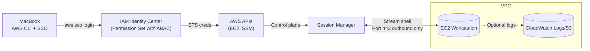

# AWS SSO Workstations

A standardized, secure way to provision and manage personal **EC2 workstations** using **AWS SSO** and **AWS Systems Manager Session Manager** (no inbound SSH required).

This system provides automated EC2 workstation provisioning with modern AWS security practices including SSO authentication, attribute-based access control (ABAC), and Session Manager connectivity. Perfect for teams that need secure, cost-effective cloud workstations with zero network exposure.

## Goals
- **SSO-first**: Users authenticate with AWS IAM Identity Center (SSO) and receive short-lived credentials.
- **Zero inbound**: Access via Session Manager. No SSH keys, no open ports.
- **ABAC**: Attribute-based access control using a `username` principal tag; instances are tagged `Owner=<username>`.
- **Automated**: One-command scripts to create, connect to, and stop workstations.
- **Cost-aware**: Easy stop/terminate & (later) idle-stop automation.
- **Simple sync**: Trivial file sync between an EC2 directory and `s3://<bucket>/<prefix>/<username>/`.
- **Infrastructure as code**: All infrastructure defined in code (AWS CDK Python).
- **Custom AMIs**: Automated EC2 Image Builder pipeline for standardized workstation images.
- **Local sync**: User files stored in EC2 directory synchronized with corresponding MacBook directory.

## Architecture


**Notes**
- Public subnet is acceptable **without** any inbound rules because SSM is outbound-only; later you can place instances in **private subnets with VPC interface endpoints** for `ssm`, `ec2messages`, `ssmmessages` (and optionally `s3`, `logs`).
- Instances require **IMDSv2** and an instance profile with **`AmazonSSMManagedInstanceCore`** policy attached.
- **SSM Agent** (pre-installed on Amazon Linux 2023) establishes outbound HTTPS connection to Session Manager service.
- **S3 workspace sync** (not shown) provides per-user file synchronization via `s3://<bucket>/<prefix>/<username>/`.

## Initial Setup (One-time)

### 1. Prerequisites
- AWS CLI installed with SSO configured
- **Session Manager plugin** for AWS CLI (required to connect to workstations)
- Node.js and npm installed (for AWS CDK)
- Python 3.13+ and uv installed (for CDK Python dependencies)

**Install Session Manager plugin:**
```bash
# Option 1: Using Homebrew (recommended)
brew install awscli                    # If not already installed
brew install --cask session-manager-plugin

# Option 2: Manual installation (requires admin privileges)
curl "https://s3.amazonaws.com/session-manager-downloads/plugin/latest/mac/sessionmanager-bundle.zip" -o "sessionmanager-bundle.zip"
unzip sessionmanager-bundle.zip
sudo ./sessionmanager-bundle/install -i /usr/local/sessionmanagerplugin -b /usr/local/bin/session-manager-plugin
```

### 2. Configure AWS SSO Profiles
Add both developer and administrator profiles to your AWS config:

```ini
[sso-session bcm-sso]
sso_start_url = https://d-9a6707c126.awsapps.com/start
sso_region = us-east-2
sso_registration_scopes = sso:account:access

[profile sub-dev-dev]
sso_session = bcm-sso
sso_account_id = 058264484340
sso_role_name = Submissions-Dev-Developer
region = us-east-1

[profile sub-dev-admin]
sso_session = bcm-sso
sso_account_id = 058264484340
sso_role_name = AWSAdministratorAccess
region = us-east-1
```

### 3. Bootstrap Infrastructure
Run these commands in order:

```bash
# 1. Install AWS CDK CLI globally
npm install -g aws-cdk

# 2. Login with admin profile for bootstrapping
aws sso login --profile sub-dev-admin

# 3. Create default VPC if none exists
aws ec2 create-default-vpc --profile sub-dev-admin

# 4. Bootstrap IAM resources for SSM
./infra/scripts/bootstrap-iam-for-ssm.sh sub-dev-admin us-east-1

# 5. Bootstrap CDK toolkit (optional, for future CDK deployments)
cd cdk
uv sync
uv run cdk bootstrap --profile sub-dev-admin
```

## Daily Usage

### 1. Login with Developer Profile
```bash
aws sso login --profile sub-dev-dev
```

### 2. Create Your Workstation
```bash
./infra/scripts/create-workstation.sh \
  --profile sub-dev-dev \
  --region us-east-1 \
  --project <project-name> \
  --instance-type t3.small \
  --arch x86_64 \
  --volume-gb 50 \
  --subnet-id subnet-042e2fa6a0489e19b  # Use us-east-1a for better instance type support
```

**Note**: The `--username` parameter is optional and will be auto-detected from your current AWS SSO session if not provided.

### 3. Connect to Your Workstation
```bash
aws ssm start-session --target <instance-id> --profile sub-dev-dev --region us-east-1
```

### 4. Stop When Done
```bash
./infra/scripts/stop-workstation.sh sub-dev-dev us-east-1 [username] [project]
```

**Note**: The `username` parameter is optional and will be auto-detected from your current AWS SSO session if not provided.

## Custom AMI Creation

### Build Custom Workstation AMIs
Create standardized AMIs with pre-installed development tools using EC2 Image Builder:

```bash
# Create Image Builder pipeline and start first build
./infra/image-builder/scripts/create-ami.sh \
  --subnet-id subnet-042e2fa6a0489e19b \
  --security-group sg-060f1c9f0d0b54238 \
  --profile sub-dev-admin \
  --start-build

# Monitor build progress (builds take ~20-30 minutes)
aws imagebuilder list-image-builds --profile sub-dev-admin --region us-east-1 \
  --query 'imageBuildVersionList[0].{Status:state.status,Reason:state.reason,Progress:state.progress}'

# List completed AMIs
aws ec2 describe-images --owners self --profile sub-dev-admin --region us-east-1 \
  --filters 'Name=name,Values=AL2023-Workstation-*' \
  --query 'Images[].{Name:Name,ImageId:ImageId,CreationDate:CreationDate}' \
  --output table
```

### Using Custom AMIs
Once built, update your workstation creation to use the custom AMI:

```bash
# Find your latest custom AMI
CUSTOM_AMI=$(aws ec2 describe-images --owners self --profile sub-dev-admin --region us-east-1 \
  --filters 'Name=name,Values=AL2023-Workstation-*' \
  --query 'Images | sort_by(@, &CreationDate) | [-1].ImageId' --output text)

# Create workstation with custom AMI
./infra/scripts/create-workstation.sh \
  --profile sub-dev-admin \
  --region us-east-1 \
  --project <project-name> \
  --instance-type t3.small \
  --arch x86_64 \
  --volume-gb 50 \
  --subnet-id subnet-042e2fa6a0489e19b \
  --ami-id $CUSTOM_AMI
```

### What's Included in Custom AMIs
The Image Builder pipeline creates Amazon Linux 2023 AMIs with:
- **Development tools**: tmux, git, emacs-nox, wget, curl, unzip
- **Node.js 20**: Latest LTS with npm
- **Python tooling**: uv (fast Python package manager)
- **AWS tools**: AWS CLI v2, Session Manager plugin
- **Automatic updates**: Weekly builds every Sunday at 09:00 UTC

## Troubleshooting

### Common Issues

**"SessionManagerPlugin is not found"**
Install the Session Manager plugin:
```bash
brew install --cask session-manager-plugin
```

**"No default VPC found"**
```bash
aws ec2 create-default-vpc --profile sub-dev-admin
```

**"Unsupported instance type in Availability Zone"**
- Specify a different subnet with `--subnet-id` parameter
- Try us-east-1a subnet: `subnet-042e2fa6a0489e19b`
- Use t3.small instead of t3.micro/t3.nano for better AZ support

**"Permission denied" when running scripts**
```bash
# Use bash explicitly
bash ./infra/scripts/create-workstation.sh [options]
```

**"CDK deployment fails with permission boundaries"**
- Use the admin profile for initial bootstrap: `--profile sub-dev-admin`
- The system works without CDK deployment - IAM resources are created by bootstrap script

**"Duplicate security group rule"**
- This is expected on subsequent runs - the script will continue successfully
- Security groups are reused between workstation creations

### Available Subnets in us-east-1
```
us-east-1a: subnet-042e2fa6a0489e19b (recommended)
us-east-1b: subnet-0ad98f118ac401462
us-east-1c: subnet-05b62d63755840714
us-east-1d: subnet-019592a79b5036329
us-east-1e: subnet-07338f9d6c34cf90f
us-east-1f: subnet-00b31d438ae1f2a53
```

## S3 Sync (per-user workspace)
We suggest a dedicated directory on EC2, e.g., `/home/ec2-user/workspace`, synced to `s3://<bucket>/<prefix>/<username>/`.

- One-way **upload** from EC2 → S3 during/after work:
  ```bash
  ./infra/scripts/s3-sync.sh push <bucket> <prefix> [username] [path] [profile] [region]
  ```
- One-way **download** from S3 → EC2 at start:
  ```bash
  ./infra/scripts/s3-sync.sh pull <bucket> <prefix> [username] [path] [profile] [region]
  ```
- For convenience, use `infra/scripts/s3-sync.sh` as shown above. The `username`, `path`, `profile`, and `region` parameters are optional with sensible defaults.
- Avoid FUSE mounts (e.g., s3fs) for POSIX-heavy or latency-sensitive workloads; S3 is object storage, not a POSIX filesystem.

**Note**: The username will be auto-detected from your current AWS SSO session if not provided.

### Bucket policy (optional, ABAC with username)
Example that lets signed-in principals with a `username` principal tag read/write **only** their own prefix. Replace `<bucket>` and `<prefix>`.
```json
{
  "Version": "2012-10-17",
  "Statement": [
    {
      "Sid": "AllowUserPrefixRW",
      "Effect": "Allow",
      "Principal": "*",
      "Action": ["s3:GetObject","s3:PutObject","s3:DeleteObject"],
      "Resource": "arn:aws:s3:::<bucket>/<prefix/${aws:PrincipalTag/username}>/*",
      "Condition": {"StringLike": {"aws:PrincipalTag/username": "*"}}
    }
  ]
}
```
> Ensure IAM Identity Center maps your directory attribute to the **principal tag** `username` (Settings → Attribute mappings). All users then get access only to `/<prefix>/<username>/` by default.

## Work From Home (WFH) & Security Groups
- **Default**: No inbound rules required. Session Manager uses **outbound HTTPS (443)** to AWS endpoints.
- **If SSH is ever required**: Prefer **EC2 Instance Connect Endpoint** or **AWS Client VPN (SAML)** over a public port 22. Keep this out-of-scope initially.

## Repository Layout
```
shared/
  image-builder/
    components/
      workstation-dev-tools.yml
infra/
  scripts/
    common-utils.sh             # Shared utility functions
    bootstrap-iam-for-ssm.sh
    create-workstation.sh
    start-session.sh
    stop-workstation.sh
    s3-sync.sh
  image-builder/
    scripts/
      create-ami.sh
  policies/
    permission-set-abac.json
    permission-set-abac-explicit-deny.json
cdk/
  app.py
  workstation_baseline.py
  image_builder.py
  pyproject.toml
```

## Implementation Details
- **Username auto-detection**: Scripts automatically extract username from SSO session to ensure ABAC compliance
- **Instance tagging**: `Owner=<sso-username>`, `Project=<project>`, `Name=<project>-<sso-username>`
- **ABAC security**: Permission set allows run/start/stop/terminate/SSM **only** when `Owner` matches `${aws:PrincipalTag/username}`
- **IMDSv2 required**: All instances launched with metadata service v2 enforced
- **Zero inbound access**: Security groups have no inbound rules, all access via Session Manager

## Future work (optional)
- **Idle stop**: EventBridge rule + Lambda/SSM Automation to detect idle (no SSM sessions, CPU/Network low, no batch jobs) and stop. Note: A tmux session containing processes like bash, less, and vim should not be sufficient for the EC2 instance to be considered non-idle.
- **Private subnets + endpoints** for SSM, S3, (Logs) to remove public IPs entirely.
- **Session logs** to CloudWatch/S3.
- **MacBook sync**: Direct synchronization between MacBook and EC2 workspace directories (beyond S3 sync).

## Frequently Asked Questions
**Q: Why not just SSH?**  
A: SSM removes inbound exposure, centralizes audit, and avoids key management.

**Q: Why not s3fs?**  
A: S3 is object storage; POSIX semantics are partial and latency can bite. `aws s3 sync` is predictable and robust for content-based workflows.

**Q: Which IaC should we use?**  
A: Since we are AWS-only and Python-strong, use **AWS CDK (Python)** to define shared infra (SSM logging, VPC endpoints, buckets, KMS). Keep per-user workstation lifecycle as CLI scripts.
