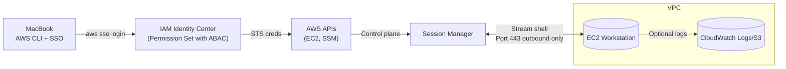

# Submissions AWS Shell

A standardized, secure way for each team member to start a personal **EC2 workstation** from their Mac terminal using **AWS SSO** and connect via **AWS Systems Manager Session Manager** (no inbound SSH).

The Submissions team needs a standard AWS EC2 image and set of local tools to support activities that cannot be done on either their local MacBooks and should not or cannot be done on any of the on-prem clusters. Managing direct cost is a high priority that must be balanced against maintaining an efficient and pleasant work environment.

## Goals
- **SSO-first**: Users authenticate with AWS IAM Identity Center (SSO) and receive short-lived credentials.
- **Zero inbound**: Access via Session Manager. No SSH keys, no open ports.
- **ABAC**: Attribute-based access control using a `username` principal tag; instances are tagged `Owner=<username>`.
- **Automated**: One-command scripts to create, connect to, and stop workstations.
- **Cost-aware**: Easy stop/terminate & (later) idle-stop automation.
- **Simple sync**: Trivial file sync between an EC2 directory and `s3://<bucket>/<prefix>/<username>/`.
- **Infrastructure as code**: All infrastructure defined in code (AWS CDK Python).
- **Easy machine images**: Simple construction of new machine images and VM definitions.
- **Local sync**: User files stored in EC2 directory synchronized with corresponding MacBook directory.

## Architecture


**Notes**
- Public subnet is acceptable **without** any inbound rules because SSM is outbound-only; later you can place instances in **private subnets with VPC interface endpoints** for `ssm`, `ec2messages`, `ssmmessages` (and optionally `s3`, `logs`).
- Instances require **IMDSv2** and an instance profile with **`AmazonSSMManagedInstanceCore`** policy attached.
- **SSM Agent** (pre-installed on Amazon Linux 2023) establishes outbound HTTPS connection to Session Manager service.
- **S3 workspace sync** (not shown) provides per-user file synchronization via `s3://<bucket>/<prefix>/<username>/`.

## Quickstart
1. **Login with SSO** (once per shell):
   ```bash
   aws sso login --profile <sso-profile>
   ```
2. **One-time bootstrap** (creates instance role/profile for SSM):
   ```bash
   ./infra/scripts/bootstrap-iam-for-ssm.sh <sso-profile> <region>
   ```
3. **Create your workstation**:
   ```bash
   ./infra/scripts/create-workstation.sh      --profile <sso-profile> --region <region>      --username <your-username> --project bio-ws      --instance-type t3.small --arch x86_64 --volume-gb 50
   ```
4. **Start a shell**:
   ```bash
   ./infra/scripts/start-session.sh <sso-profile> <region> <instance-id>
   ```
5. **Stop it when done**:
   ```bash
   ./infra/scripts/stop-workstation.sh <sso-profile> <region> <your-username> [project]
   ```

## S3 Sync (per-user workspace)
We suggest a dedicated directory on EC2, e.g., `/home/ec2-user/workspace`, synced to `s3://<bucket>/<prefix>/<username>/`.

- One-way **upload** from EC2 → S3 during/after work:
  ```bash
  aws s3 sync /home/ec2-user/workspace s3://<bucket>/<prefix>/<username>/ --delete
  ```
- One-way **download** from S3 → EC2 at start:
  ```bash
  aws s3 sync s3://<bucket>/<prefix>/<username>/ /home/ec2-user/workspace
  ```
- For convenience, use `infra/scripts/s3-sync.sh` (see below). Avoid FUSE mounts (e.g., s3fs) for POSIX-heavy or latency-sensitive workloads; S3 is object storage, not a POSIX filesystem.

### Bucket policy (optional, ABAC with username)
Example that lets signed-in principals with a `username` principal tag read/write **only** their own prefix. Replace `<bucket>` and `<prefix>`.
```json
{
  "Version": "2012-10-17",
  "Statement": [
    {
      "Sid": "AllowUserPrefixRW",
      "Effect": "Allow",
      "Principal": "*",
      "Action": ["s3:GetObject","s3:PutObject","s3:DeleteObject"],
      "Resource": "arn:aws:s3:::<bucket>/<prefix/${aws:PrincipalTag/username}>/*",
      "Condition": {"StringLike": {"aws:PrincipalTag/username": "*"}}
    }
  ]
}
```
> Ensure IAM Identity Center maps your directory attribute to the **principal tag** `username` (Settings → Attribute mappings). All users then get access only to `/<prefix>/<username>/` by default.

## Work From Home (WFH) & Security Groups
- **Default**: No inbound rules required. Session Manager uses **outbound HTTPS (443)** to AWS endpoints.
- **If SSH is ever required**: Prefer **EC2 Instance Connect Endpoint** or **AWS Client VPN (SAML)** over a public port 22. Keep this out-of-scope initially.

## Repository Layout
```
infra/
  scripts/
    bootstrap-iam-for-ssm.sh
    create-workstation.sh
    start-session.sh
    stop-workstation.sh
    s3-sync.sh
  policies/
    permission-set-abac.json
    permission-set-abac-explicit-deny.json
cdk/
  app.py
  pyproject.toml
```

## Implementation Details
- Instances are tagged `Owner=<username>`, `Project=<project>`, `Name=<project>-<username>`.
- ABAC permission set allows run/start/stop/terminate/SSM **only** when `Owner` matches `${aws:PrincipalTag/username}`.
- IMDSv2 is **required** at launch.
- Security Group has **no inbound** rules (all outbound permitted).

## Future work (optional)
- **Idle stop**: EventBridge rule + Lambda/SSM Automation to detect idle (no SSM sessions, CPU/Network low, no batch jobs) and stop. Note: A tmux session containing processes like bash, less, and vim should not be sufficient for the EC2 instance to be considered non-idle.
- **Private subnets + endpoints** for SSM, S3, (Logs) to remove public IPs entirely.
- **Session logs** to CloudWatch/S3.
- **MacBook sync**: Direct synchronization between MacBook and EC2 workspace directories (beyond S3 sync).

## Frequently Asked Questions
**Q: Why not just SSH?**  
A: SSM removes inbound exposure, centralizes audit, and avoids key management.

**Q: Why not s3fs?**  
A: S3 is object storage; POSIX semantics are partial and latency can bite. `aws s3 sync` is predictable and robust for content-based workflows.

**Q: Which IaC should we use?**  
A: Since we are AWS-only and Python-strong, use **AWS CDK (Python)** to define shared infra (SSM logging, VPC endpoints, buckets, KMS). Keep per-user workstation lifecycle as CLI scripts.
